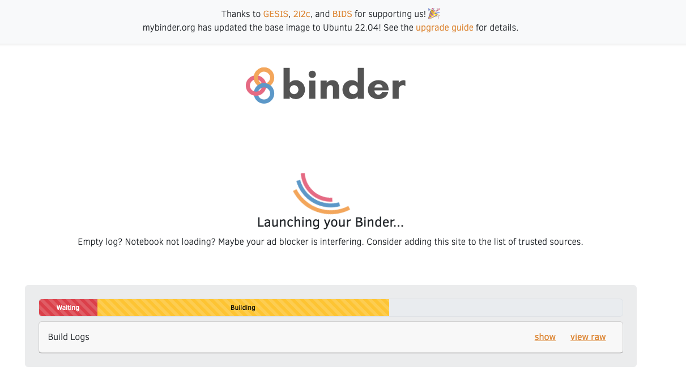
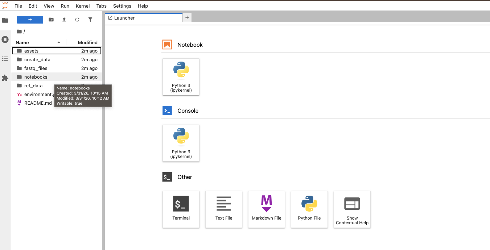
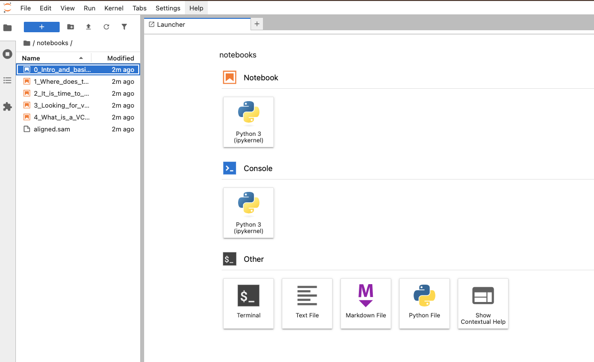

# 🧬 Welcome to the Introduction to Clinical Bioinformatics Genomics module

Welcome! We are delighted to have you on this rotation with the Bioinformatics team at WGLS.

This module follows a new learning approach that combines e-learning materials developed by **NHS England Genomics Education** with hands-on practical activities created by our bioinformatics team. You are among the first trainees to follow this combined format — so your experience and feedback will be genuinely valuable in shaping how we teach this in the future.

---

## 📚 Step 1 — Complete the prerequisite e-learning first

Before working through the practical notebooks below, you should complete the following two courses on the **NHS England Genomics Training Academy (GTAC)** virtual learning environment:

| Course | Purpose |
|---|---|
| **Fundamentals of Clinical Bioinformatics: Pipelines and Data** | Covers the key steps in a bioinformatics pipeline and common file formats — the theory behind everything you will do practically here |
| **Introduction to Bioinformatics** | A learning package designed specifically for first-year STP trainees on a clinical bioinformatics genomics rotation |

### How to access

1. Go to the GTAC virtual learning environment (PGVLE): **https://pgvle.co.uk/login/index.php**
2. Log in with your account. If you do not yet have an account, contact your local education or training lead to receive a registration pack
3. For more information about GTAC: **https://www.genomicseducation.hee.nhs.uk/about-us/gtac/**

### Learning outcomes

After completing the e-learning, you will be able to:

- Define the term 'bioinformatics'
- Describe how bioinformatics analysis sits within a typical massively parallel sequencing (NGS) sample pathway
- List the key steps in a typical bioinformatics pipeline, including pre-processing, alignment, variant calling, filtering and annotation
- Describe the common file formats used for storing biological data

### Module competencies

We recommend that before diving into the detail, you take the **10 competencies** for this module and quickly check that the content provided by Genomics Education covers each one. If you feel anything is not well addressed, please let us know — your input helps us improve.

👉 [View the STP module competencies (S-BG-R1-0)](https://curriculumlibrary.nshcs.org.uk/stp/module/S-BG-R1-0/)

---

## 🖥️ Step 2 — Work through the practical notebooks

Once you have completed the e-learning, this repository gives you a hands-on environment to see a real NGS bioinformatics pipeline in action. We believe the best way to understand how bioinformaticians work is to interact with the tools and data ourselves.

We have built this using **Binder** — a free cloud platform that lets you run Jupyter notebooks directly in your browser, with all the bioinformatics tools pre-installed. No software installation is needed on your end.

### Notebooks

| Notebook | Topic |
|---|---|
| 0 — Introduction and basic Linux commands | The environment, terminal basics, Linux commands |
| 1 — Where does the data come from? | Sequencing concepts, FASTQ files, FastQC |
| 2 — It is time to map | BWA alignment, SAM/BAM, samtools, IGV visualisation |
| 3 — Looking for variants | Variant calling with bcftools |
| 4 — What is a VCF file? | VCF format in depth, filtering, clinical context |

### How to launch

**1.** Click the Binder badge at the top of this page (or here):

**2.** Binder will start building the environment. This can take a few minutes — you will see a loading screen like this:

**3.** Once it finishes, the JupyterLab interface will open. Click on the **notebooks** folder:

**4.** You will see the list of notebooks on the left. Start with notebook `0`:

> ⚠️ **Important:** The notebooks must be completed in order (0 → 1 → 2 → 3 → 4). Each notebook generates files that the next one depends on.

### How to run cells

- Read the explanations and follow the instructions step by step
- Run each cell using **Shift + Enter**
- Linux commands are prefixed with `!` (e.g. `!ls`, `!fastqc`)

---

## 🤝 Support during your rotation

You are the first group to follow this combined learning format, so if something does not work, is unclear, or simply does not make sense — please say so. Manuel is available throughout your two weeks, and we will minimise other commitments to be available on demand for any Teams or in-person meeting you need.

In addition to that, we have planned a series of sessions where we will review topics that can feel particularly abstract, and you are also welcome to propose topics you would like us to cover. We will also invite you to some of our internal bioinformatics meetings and team discussions so you can get a real sense of how we work and what our role looks like in the context of clinical genomics.

---

## 💬 Feedback

As the first cohort to follow this new format, your feedback is essential. At the end of the rotation, we will share a short feedback form — please take a few minutes to complete it. It will directly influence how this resource develops for future trainees.

### A personal note on workload

Between the GTAC materials and our own resources, we are aware that the total volume of content can feel overwhelming — especially because the GTAC courses include activities before, during, and after. We are not asking you to do everything.

The honest reality is that as educators, one of our biggest challenges is that we rarely know the background of each trainee in advance. As a result, the materials we provide tend to cast a wide net and cover as much as possible. Our personal recommendation is to:

1. **Start by reading the 10 competencies** for this module so you know exactly what you are expected to demonstrate
2. **Skim the available content** and use it strategically, focusing on the areas most relevant to your needs
3. **Use the GTAC activities** as a basis for the assessments you need to submit to us

On the subject of assessments — we give you a lot of flexibility. You can cover more than one competency with a single piece of work, and the format is up to you. Trainees in previous years have produced PowerPoint presentations with detailed notes in the comments, for example. There is no single right answer here.

And if at any point you feel lost — Manuel is there!

---

*Developed by the Bioinformatics team, WGLS — in collaboration with NHS England Genomics Education resources.*
